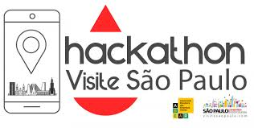

#  Hackathon Visite São 2024 📍

## Grupo FlowSP 
### Integrantes do grupo:
### [Gustavo Gonçalves da Costa](https://linkedin.com/in/gustavo-dacosta/)
### [Thiago Martins Volcati de Almeida](http://www.linkedin.com/in/thiagovolcati)
### 
### [Rafaela Silva de Oliveira Lima](https://www.linkedin.com/in/rafaela-silva-de-oliveira-lima-23760925b/)
## Sumário
[1. Introdução](#1-introdução)

[2. Metodología](#2-metodología)

&emsp; [2.1. Agile](#21-agile)

&emsp; [2.2. Duplo Diamante](#22-duplo-diamante)

&emsp; [2.3. Ferramenta GUT](#23-ferramenta-gut)

[3. Contexto](#3-contexto)

&emsp; [3.1. Problemática](#31-problemática)

&emsp; [3.2. Análise de Mercado](#32-análise-de-mercado)

&emsp; &emsp; [3.2.1. Análise SWOT](#321-análise-swot)

&emsp; &emsp; [3.2.2. Canvas Propósta de Volor](#322-canvas-proposta-de-valor)

&emsp; &emsp; [3.2.3. Oceano Azul e Vermelho](#323-oceano-azul-e-vermelho)

[4. Análise do Usuário](#4-análise-do-usuário)

&emsp; [4.1. Pesquisa de Entendimento do Usuário](#41-pesquisa-de-entendimento-do-usuário)

&emsp; [4.2. Personas](#42-personas)

&emsp; [4.3. Mapas de Empatia](#43-mapa-de-empatia)

&emsp; [4.4. User Stories](#44-user-stories)

[5. Solução](#5-solução)

[6. Monetização e Marketing](#6-monetização-e-marketing)

[Anexos](#c8)

 

# 1. Introdução 
 &emsp; Na edição de 2024 do hackathon (Visite São Paulo), os responsáveis apresentaram uma proposta inovadora: utilizar a tecnologia para transformar os moradores de São Paulo em turistas em sua própria cidade.

 &emsp; Nesse contexto, o grupo FLowSP desenvolveu um MVP de uma aplicação web, com foco em dispositivos móveis, que motiva e facilita o acesso ao turismo em São Paulo de forma personalizada.

# 2. Metodología

&emsp; Nesse tópico são brevemente explicadas as metodologías usadas durante o projeto.

## 2.1. Agile

&emsp; A metodologia Agile é um conjunto de princípios e práticas para gerenciamento de projetos, especialmente em desenvolvimento de software. Ela enfatiza:

* **Iteração e Incremento:** Projetos são divididos em ciclos curtos (sprints), permitindo entregas frequentes de partes do produto.
* **Colaboração:** Foco em comunicação constante entre equipes e partes interessadas.
* **Flexibilidade:** Adaptação rápida a mudanças nas necessidades e requisitos do cliente.
* **Feedback Contínuo:** Avaliações regulares permitem ajustes e melhorias constantes.

&emsp; O Agile visa aumentar a eficiência, melhorar a qualidade e garantir que o produto final atenda às expectativas do cliente. Frameworks populares dentro do Agile incluem Scrum e Kanban.

## 2.2. Duplo Diamante

&emsp; O Duplo Diamante é uma abordagem de design que visa orientar o processo de inovação e solução de problemas. Ele é dividido em quatro fases principais:

* **Descobrir:** Explorar e entender o problema, coletando informações e insights sobre as necessidades dos usuários. (Feito nas primeiras horas do hackathon)

* **Definir:** Refinar e articular o problema, focando em uma declaração clara que guie a solução. (Feito durante metade do primeiro dia presencial do hackathon)

* **Desenvolver:*** Gerar e prototipar ideias, permitindo experimentar diversas soluções.(Realizado durante a maior parte do hackathon)

* **Entregar:** Testar, implementar e avaliar a solução final, garantindo que atenda às necessidades identificadas. (Feito nas ultimas horas do hackathon)

 &emsp; O modelo é representado por dois diamantes, simbolizando a expansão (exploração de ideias) e a contração (foco em soluções) durante o processo criativo e é demonstrado abaixo: 

 Figura x: Metodología Duplo Diamante 
 

 Fonte: Material produzido pelos autores (2024) [Link](https://www.canva.com/design/DAGUB3N6RuM/PQkavfSjtKXHZPhIy8YNmA/edit)
 

 &emsp; Essa estrutura ajuda equipes a abordar problemas de forma abrangente e colaborativa. 

## 2.3. Ferramenta GUT
&emsp; A matriz GUT é uma ferramenta de priorização que ajuda a avaliar e classificar problemas ou ações com base em três critérios:

* **Gravidade (G):** quão sério é o problema ou a situação.
* **Urgência (U):** quão rapidamente a solução precisa ser implementada.
* **Tendência (T):** a probabilidade de o problema piorar se não for resolvido.

&emsp;  Cada critério é pontuado, e a soma total ajuda a identificar quais problemas devem ser tratados com mais urgência e foco, facilitando a tomada de decisões.

&emsp; Abaixo a matriz GUT dos problemas encontrados e elencados durante o processo de criação do MVP:

 Figura x: Metodología GUT 
 

 Fonte: Material produzido pelos autores (2024) [Link](https://www.canva.com/design/DAGUB3N6RuM/PQkavfSjtKXHZPhIy8YNmA/edit)
 

# 3. Contexto

 &emsp; Neste tópico, apresentamos uma análise mais aprofundada da problemática e do contexto do mercado em que nos inserimos.
 ## 3.1. Problemática

Apesar de São Paulo ser uma cidade culturalmente rica, muitos de seus moradores não exploram as atrações turísticas disponíveis. Esse fenômeno pode ser explicado por uma combinação de fatores sociais, econômicos e culturais citados abaixo:

* **Rotina Agitada e Estilo de Vida:** A vida em São Paulo é marcada por uma rotina intensa, o que faz com que muitos moradores sintam que não têm tempo para aproveitar o que a cidade oferece.

* **Percepção de Segurança:** O medo de violência e crimes, especialmente em áreas menos conhecidas, pode inibir os moradores de explorarem novos bairros ou atrações turísticas. Um estudo do Fórum Brasileiro de Segurança Pública revela que, em 2022, 61% da população se sentiu insegura ao sair de casa.

* **Situação Financeira:** Muitas vezes, o turismo é visto como uma atividade que envolve gastos elevados. Moradores podem preferir investir seu tempo e dinheiro em atividades que consideram mais produtivas ou essenciais, como cursos e eventos de networking. O custo de vida em São Paulo, que é bastante alto, também contribui para essa escolha.

* **Acesso à Informação:** Muitos moradores não estão cientes das diversas opções de turismo disponíveis na cidade. A falta de divulgação e informações acessíveis sobre as atrações pode levar a um desinteresse geral.

* **Trabalho de Pesquisa:** Muitas vezes, a tarefa de pesquisar locais para visitar é vista como mais um compromisso na agenda já cheia. O excesso de opções, aliado à sensação de que “tudo está perto”, pode gerar procrastinação na hora de decidir.

* **Indecisão:** A indecisão é um fator comum quando se trata de escolher atividades de lazer em uma cidade tão diversa como São Paulo. Com uma infinidade de opções – museus, parques, restaurantes e eventos culturais – os moradores podem se sentir sobrecarregados. Essa dificuldade em decidir pode levar à paralisia, onde a escolha se torna tão complicada que acaba não sendo feita.

* **Acessibilidade:** Informações sobre a acessibilidade de locais e eventos muitas vezes não são facilmente disponíveis, o que impede que pessoas com deficiência façam turismo.

## 3.2. Análise de Mercado

 &emsp; A Análise de Mercado, será detalhada nesse tópico e é o processo de coleta e interpretação de dados sobre um mercado específico. Ela serve para entender tendências, concorrência, comportamento do consumidor e oportunidades de negócio. Esse tipo de análise ajuda empresas a tomar decisões informadas, desenvolver estratégias e identificar nichos de mercado.

 ### 3.2.1. Análise SWOT
 &emsp;A Análise SWOT é uma ferramenta de planejamento estratégico que avalia quatro elementos:

* **Forças (Strengths):** pontos positivos internos de uma organização.
* **Fraquezas (Weaknesses):** pontos negativos internos.
* **Oportunidades (Opportunities):** fatores externos que podem ser aproveitados.
* **Ameaças (Threats):** desafios externos que podem impactar negativamente.

 &emsp;Essa análise ajuda a identificar a posição competitiva de uma empresa e a formular estratégias para aproveitar suas forças e oportunidades, enquanto minimiza fraquezas e riscos.

 &emsp; A seguir a análise SWOT feita para esse projeto: 

  

 Figura x: Análise SWOT 
 

 Fonte: Material produzido pelos autores (2024) [Link](https://www.canva.com/design/DAGUB3N6RuM/PQkavfSjtKXHZPhIy8YNmA/edit)
 

#### Forças
- **Conectividade**: Facilidade de comunicação e acesso a informações.
- **Diversidade de Ofertas**: Variedade de pontos turísticos para diferentes necessidades.
- **Pluralidade de Experiências**: Ampla gama de vivências que atraem diversos públicos.
- **Inovação Contínua**: Compromisso com a melhoria e atualização constante.

#### Oportunidades
- **Sustentabilidade**: Demanda crescente por práticas ecológicas e responsabilidade social.
- **Desenvolvimento Local**: Fortalecimento de economias regionais e benefícios para comunidades.
- **Escalabilidade**: Capacidade de expandir a aplicação de forma eficiente.
- **Turismo Sustentável**: Interesse por turismo que respeita o meio ambiente.
- **Integração de Serviços**: Melhoria na experiência do cliente através integração de sistemas.
- **Parceria com os parceiros Visite São Paulo:** Essa parceria promove a aplicação, fazendo ela chegar a mais usuários e parceiros.

#### Fraquezas
- **Sazonalidade**: Dependência de períodos específicos que afetam o setor de turismo
- **Privacidade e Segurança**: Riscos no manejo de dados pessoais e proteção de informações.
- **Desigualdade no Acesso**: Barreiras que limitam a inclusão digital de certos grupos.

#### Ameaças
- **Concorrência Global**: Pressão de empresas internacionais com alternativas competitivas.
- **Mudanças Climáticas**: Impactos adversos que podem afetar operações e demanda.
- **Insegurança**: Preocupações que podem afastar clientes.
- **Desinformação**: Dificuldades em garantir a veracidade das informações.
- **Obsolescência Rápida**: Necessidade de adaptação constante a novas tecnologias.

 

### 3.2.2. Canvas Proposta de Valor
 &emsp; O Canvas da Proposta de Valor é uma ferramenta que ajuda a definir como um produto ou serviço atende às necessidades dos clientes. Ele permite visualizar de forma clara o que diferencia a oferta, identificando os problemas que resolve, os benefícios que proporciona e como se destaca da concorrência. Essa estrutura facilita a criação de propostas mais atraentes e relevantes para o público-alvo.

  &emsp; Abaixo o Canvas Proposta de Valor deste prjeto:

 

 Figura x: Canvas Proposta de Valor 
 

 Fonte: Material produzido pelos autores (2024) [Link](https://www.canva.com/design/DAGUB3N6RuM/PQkavfSjtKXHZPhIy8YNmA/edit)
 

#### Criador de Ganhos
- Incentivo ao turismo local
- Anúncios personalizados
- Cadastro dos pontos turísticos

#### Produto
- Plataforma web com foco em mobile.
- Sistema de recomendação e roteirização de atrativos turísticos da cidade de São Paulo.

#### Alívios
- Eliminação da necessidade de pesquisa extensa e confusa.
- Rotas personalizadas.
- Decisão rápida sobre onde passear em São Paulo.
- Filtros para acessibilidade.

#### Dores
- Custos altos em passeios.
- Moradores da cidade não conhecem os pontos turísticos.
- Falta de tempo para roteirizar passeios.
- Dificuldade de manter o comércio em baixa temporada.
- Dificuldade de decidir onde visitar.

#### Trabalhos do Cliente
- Decidir onde passear em São Paulo.
- Planejar roteiros de forma eficiente.
- Descobrir novas experiências e eventos na cidade.

#### Ganhos
- Economia de tempo.
- Aumento da economia do turismo interno.
- Novos conhecimentos sobre a cidade.
- Passeios acessíveis.

### 3.2.3. Oceano Azul e Vermelho

&emsp;As estratégias de Oceano Azul e Oceano Vermelho são conceitos usados em gestão e marketing:

* **Oceano Vermelho:** Refere-se a mercados saturados e altamente competitivos, onde as empresas competem por uma fatia limitada de mercado. Nesse cenário, a rivalidade é intensa, e as margens de lucro tendem a ser menores.

* **Oceano Azul:** Representa a criação de novos mercados e oportunidades, onde a concorrência é irrelevante. As empresas que operam em um Oceano Azul inovam, oferecendo propostas de valor únicas, o que permite maior crescimento e margens de lucro.

&emsp; Essas estratégias incentivam a busca por inovação e diferenciação em vez de competir diretamente em mercados existentes.

A tabela abaixo demonstra o porque da applicação Flow ser um Oceano Azul:

 Figura x: Comparação Oceano Azul (Flow) e Oceano Vermelho 
 

 Fonte: Material produzido pelos autores (2024) [Link](https://www.canva.com/design/DAGUB3N6RuM/PQkavfSjtKXHZPhIy8YNmA/edit)
 

 | Aspecto                         | Mercado Tradicional                                          | FlowSP                                                       |
|--------------------------------|-------------------------------------------------------------|-------------------------------------------------------------|
| Personalização                  | Ofertas genéricas e pacotes padrão                         | Recomendações personalizadas com base em preferências individuais |
| Planejamento                    | Fragmentado; exige múltiplas fontes de informação           | Planejamento integrado e simplificado em um único site      |
| Rotas                           | Não otimiza rotas; depende de pesquisa manual               | Geração automática de rotas otimizadas, considerando transporte disponível |
| Feedback                        | Pouca interação pós-visita; avaliações limitadas            | Sistema de avaliações em tempo real para feedback contínuo   |
| Acessibilidade                  | Poucas opções para necessidades especiais                   | Inclusão de critérios específicos (ex.: transporte adaptado)  |
| Experiências                    | Foco em atrações turísticas; experiências limitadas        | Integração de opções de alimentação, esportes e atividades locais |
| Interação com Negócios Locais  | Geralmente ausente; pouco apoio a negócios locais          | Parcerias com negócios locais para oferecer experiências autênticas |
| Modelo de Monetização           | Baseado em comissões e preços fixos                        | Pagamento por destaque para pontos turísticos, incentivando qualidade |
| Engajamento do Usuário          | Baixo; os usuários são consumidores passivos                | Alto; usuários interagem e influenciam suas experiências     |
| Inovação                        | Baixa; muitas empresas resistem a mudanças                  | Alta; uso de IA e tecnologia para melhorias contínuas         |

# 4. Análise do Usuário

&emsp; A análise do usuário é uma abordagem que envolve a coleta e avaliação de informações sobre as necessidades, comportamentos e preferências dos usuários de um produto ou serviço. Ela serve para entender melhor o público-alvo, permitindo que empresas e desenvolvedores:

* **Melhorem a Experiência do Usuário:** Ao identificar as expectativas e desafios dos usuários, é possível criar soluções mais intuitivas e satisfatórias.
* **Personalizem Ofertas:** A análise permite oferecer produtos e serviços mais relevantes, aumentando a satisfação e a fidelidade dos clientes.
* **Orientem o Desenvolvimento de Produtos:** Compreender o que os usuários realmente desejam ajuda a priorizar funcionalidades e inovações que agregam valor.

&emsp;Essa prática é essencial para garantir que as soluções atendam às necessidades reais do público, resultando em um melhor engajamento e sucesso no mercado.

## 4.1. Pesquisa de Entendimento do Usuário

## 4.2. Personas
&emsp; Personas são representações fictícias de usuários ou clientes ideais, baseadas em dados reais e pesquisas sobre o público-alvo. Elas ajudam a entender melhor as motivações, comportamentos e necessidades dos usuários, servindo como uma ferramenta fundamental em design, marketing e desenvolvimento de produtos.

&emsp; Baseados a pesquisa explicitada no tópico anterior, fizemos as seguintes personas:

 Figura x: Persona 1- Giovanna 
 

 Fonte: Material produzido pelos autores (2024) [Link](https://www.canva.com/design/DAGUB3N6RuM/PQkavfSjtKXHZPhIy8YNmA/edit)
 

 #### Persona: Giovanna Sales

- **Nome**: Giovanna Sales
- **Localização**: São Paulo, SP
- **Idade**: 37 anos
- **Profissão**: Executiva

#### Informações Pessoais
- **Estado Civil**: Casada
- **Filhos**: Dois

#### Desafios
- Dificuldade em encontrar lugares acessíveis para seu marido, que tem problemas de mobilidade.
- As crianças ficam entediadas durante passeios.
- Falta de tempo e disposição para pesquisar opções que atendam às necessidades da família.
- Orçamento apertado para passeios com quatro pessoas.

#### Objetivos
- Sair mais com a família e amigos, aproveitando experiências que sejam acessíveis e interessantes para todos.

 

 Figura x: Persona 2- Márcia 
 

 Fonte: Material produzido pelos autores (2024) [Link](https://www.canva.com/design/DAGUB3N6RuM/PQkavfSjtKXHZPhIy8YNmA/edit)
 

#### Persona: Márcia Maria

- **Nome**: Márcia Maria
- **Localização**: São Paulo, SP
- **Idade**: 52 anos
- **Profissão**: Empreendedora

#### Informações Pessoais
- **Negócio**: Dona de um pequeno resort acessível e com preço justo.

#### Desafios
- O resort tem bom desempenho durante a alta temporada, mas enfrenta dificuldades na baixa temporada devido à falta de clientes.
- Poucas pessoas conhecem o resort, e muitos preferem viajar para fora da cidade para relaxar.

#### Objetivos
- Atrair mais clientes para seu ponto turístico paradisíaco no meio de São Paulo, aumentando a visibilidade e a ocupação durante todo o ano.

&emsp; As personas de Giovanna e Márcia revelam a importância de oferecer soluções acessíveis e experiências únicas que atendam às necessidades específicas de cada público. Ao focar em acessibilidade e promoção, é possível aumentar a satisfação e a visibilidade, beneficiando tanto as famílias quanto os negócios locais.

## 4.3. Mapa de Empatia
&emsp;O Mapa de Empatia é uma ferramenta visual que ajuda a entender melhor os usuários ou clientes, permitindo uma análise profunda de suas emoções, necessidades e comportamentos. Ele é dividido em várias seções que capturam diferentes aspectos da experiência do usuário. Abaixo seguem os Mapas de Empatia das duas personas:

 #### Mapa de Empatia: Giovanna

 Figura x: Mapa da Empatia 1 - Giovanna 
 

 Fonte: Material produzido pelos autores (2024) [Link](https://www.canva.com/design/DAGUB3N6RuM/PQkavfSjtKXHZPhIy8YNmA/edit)
 

#### O que Giovanna Sente
- Não sai o suficiente com amigos e família.
- Não acha lugares que goste para sair.
- Sente que sair é muito caro.
- Gasta mais tempo planejando e organizando do que se divertindo.
- Nota a dificuldade em encontrar atividades que mantenham as crianças entretidas.

#### O que Giovanna Observa
- As opções de lazer muitas vezes não consideram a mobilidade do marido.

#### O que Giovanna Ouve
- Recebe conselhos de amigos e familiares sobre como equilibrar trabalho e vida pessoal, mas nem sempre se aplica na prática.

#### O que Giovanna Diz e Faz
- Tenta organizar passeios, mas acaba se sentindo desmotivada.

#### Dores
- Dificuldade em encontrar lugares acessíveis.
- Orçamento limitado para passeios em família.
- Falta de tempo e disposição para planejar atividades que atendam a todos.
- As crianças se entediam em passeios que não são adaptados para elas.

#### Ganhos
- Passar mais tempo de qualidade com a família e amigos em lugares acessíveis.
- Encontrar atividades que sejam divertidas para as crianças.
- Simplificar a pesquisa de passeios para que possa aproveitar mais os momentos de lazer.

 #### Mapa de Empatia: Márcia
 

 Figura x: Mapa da Empatia 2- Márcia 
 

 Fonte: Material produzido pelos autores (2024) [Link](https://www.canva.com/design/DAGUB3N6RuM/PQkavfSjtKXHZPhIy8YNmA/edit)
 

#### O que Márcia Sente
- Nota que muitos turistas preferem viajar para fora da cidade em busca de lazer.
- Sente frustração por poucas pessoas conhecerem o resort e suas ofertas.

#### O que Márcia Escuta
- Escuta feedbacks de clientes sobre a qualidade do serviço e das instalações de clientes de outras cidades.

#### O que Márcia Diz e Faz
- Fala sobre a necessidade de aumentar a visibilidade do resort.
- Tenta implementar promoções ou eventos, mas não tem certeza se são suficientes.
- Participa de feiras e eventos de turismo na esperança de atrair novos clientes.

#### Dores
- Baixa taxa de ocupação na baixa temporada.
- Falta de reconhecimento da marca e do resort na região.
- Dificuldade em comunicar a acessibilidade e o preço justo do resort.

#### Ganhos
- Aumentar a visibilidade do resort e atrair mais clientes durante todo o ano.
- Construir uma comunidade de clientes fiéis que recomende o resort.
- Preocupa-se com a sustentabilidade do negócio durante a baixa temporada.
- Deseja proporcionar experiências agradáveis aos clientes para que voltem.

 ## 4.4. User Stories
 &emsp;User Stories (ou histórias de usuário) são uma técnica utilizada no desenvolvimento ágil de software para capturar requisitos do usuário de forma simples e compreensível. Elas descrevem uma funcionalidade do ponto de vista do usuário e são escritas em uma linguagem acessível, focando nas necessidades e expectativas do usuário. 

 #### User Stories Giovanna

 

 Figura x: User Stories 1 - Giovanna 
 

 Fonte: Material produzido pelos autores (2024) [Link](https://www.canva.com/design/DAGUB3N6RuM/PQkavfSjtKXHZPhIy8YNmA/edit)
 

- **Como mãe ocupada**: Quero que a aplicação me sugira atividades acessíveis para a família, para que eu possa planejar passeios que todos possam aproveitar.

- **Como Giovanna**: Gostaria de receber recomendações de lugares que têm entretenimento para crianças, para que elas não fiquem entediadas.

- **Como esposa de alguém com mobilidade reduzida**: Quero que a plataforma destaque locais que são acessíveis, para evitar surpresas desagradáveis.

- **Como mãe**: Quero que a aplicação faça o planejamento dos passeios, para que eu economize tempo e energia na pesquisa de opções.

- **Como Giovanna**: Quero sugestões de passeios que se encaixem no meu orçamento familiar, para que possamos aproveitar sem estourar as contas.

- **Como usuária**: Gostaria de poder avaliar e comentar sobre as experiências que vivenciei, para ajudar outras famílias a escolherem melhores opções.

- **Como Giovanna**: Gostaria de um recurso que me permitisse filtrar opções com base nas preferências e necessidades da minha família, para facilitar a escolha.

- **Como mãe**: Quero que a plataforma forneça informações sobre atividades específicas para crianças, como horários e tipos de entretenimento.

 #### User Stories Marcia

 

 Figura x: User Stories 2- Márcia 
 

 Fonte: Material produzido pelos autores (2024) [Link](https://www.canva.com/design/DAGUB3N6RuM/PQkavfSjtKXHZPhIy8YNmA/edit)

 
 

 

- **Como proprietária de um resort**: Quero que minha propriedade seja exibida em recomendações personalizadas, para que mais pessoas conheçam meu negócio.

- **Como empreendedora**: Quero ter acesso a feedbacks em tempo real, para que eu possa melhorar os serviços do meu resort e atrair mais clientes.

- **Como gestora de um negócio acessível**: Quero que minha propriedade seja facilmente encontrada por pessoas com necessidades especiais, para que eu possa atender a esse público.

- **Como proprietária**: Quero participar de campanhas em uma plataforma, para aumentar minha visibilidade durante a baixa temporada.

- **Como gestora**: Quero ter acesso a dados sobre as preferências dos usuários, para criar experiências personalizadas que atendam ao que eles buscam.

 # 5. Solução 

 # 6. Monetização e Marketing

  &emsp; Como formas de monetização escolhemos:

* **Anúncios:**  Anúncios personalizados que aparecem na parte lateral da página.
* **Parcerias Pagas:** Empreendimentos podem pagar uma taxa mensal para receber um selo de verificação de parceiro. Essa parceria garante prioridade nas recomendações dentro do sistema, aumentando a visibilidade e credibilidade do negócio.

  &emsp; A estratégia de marketing consiste em oferecer o selo de verificação aos empreendimentos parceiros da Visite São Paulo. Isso não apenas reforça a confiança dos consumidores, mas também atrai mais empreendimentos interessados em se beneficiar do selo, ampliando nossa rede de parcerias.

